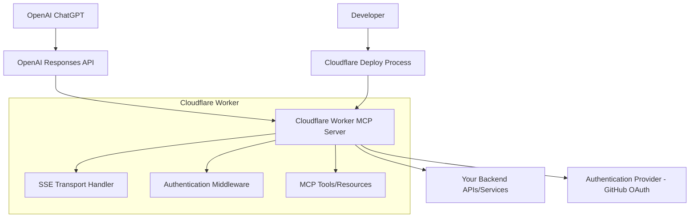

# Deploying a Cloudflare Remote MCP Server for OpenAI ChatGPT Connectors

Based on analysis of OpenAI Remote MCP documentation, Cloudflare MCP server documentation, and the Model Context Protocol specification, this plan outlines the complete deployment process for a Cloudflare-hosted MCP server compatible with OpenAI ChatGPT Connectors.

## Key Technical Requirements

From the documentation analysis, OpenAI's Remote MCP tool supports:
- **Transport Protocols**: Streamable HTTP and HTTP/SSE (Server-Sent Events)
- **Authentication**: Headers-based (primarily Authorization header)
- **Compatibility**: Must work with OpenAI's Responses API
- **Session Management**: Uses `Mcp-Session-Id` headers for state management
- **Protocol Version**: Supports `MCP-Protocol-Version: 2025-03-26`

## Architecture Overview



## Implementation Plan

### Phase 1: Basic Deployment (No Authentication)

#### 1. Initialize Cloudflare Worker
```bash
npm create cloudflare@latest -- my-mcp-server --template=cloudflare/ai/demos/remote-mcp-authless
cd my-mcp-server
```

#### 2. Configure Transport Layer
- Implement SSE (Server-Sent Events) transport
- Ensure `/sse` endpoint for connection initiation
- Implement `/messages` POST endpoint for message handling
- Add proper CORS headers for OpenAI access

#### 3. Deploy and Test
```bash
# Local development
npm start  # Available at http://localhost:8787/sse

# Test with MCP Inspector
npx @modelcontextprotocol/inspector@latest
# Open http://localhost:5173 and connect to http://localhost:8787/sse

# Deploy to production
npx wrangler@latest deploy
```

#### 4. Validate OpenAI Integration
Test with OpenAI's Responses API:
```python
from openai import OpenAI

client = OpenAI()

resp = client.responses.create(
    model="gpt-4.1",
    tools=[
        {
            "type": "mcp",
            "server_label": "your-cloudflare-mcp",
            "server_url": "https://your-worker.workers.dev/sse",
            "require_approval": "never"
        }
    ],
    input="Test query for your MCP server"
)
```

### Phase 2: Add Authentication (Production-Ready)

#### 1. OAuth Integration Setup
```bash
npm create cloudflare@latest -- my-mcp-server-auth --template=cloudflare/ai/demos/remote-mcp-github-oauth
cd my-mcp-server-auth
```

#### 2. Configure GitHub OAuth Apps

**Development OAuth App:**
- Application name: `My MCP Server (local)`
- Homepage URL: `http://localhost:8787`
- Authorization callback URL: `http://localhost:8787/callback`

**Production OAuth App:**
- Application name: `My MCP Server (production)`
- Homepage URL: `https://worker-name.account-name.workers.dev`
- Authorization callback URL: `https://worker-name.account-name.workers.dev/callback`

#### 3. Environment Configuration

**Local Development:**
```bash
touch .dev.vars
echo 'GITHUB_CLIENT_ID="your-local-client-id"' >> .dev.vars
echo 'GITHUB_CLIENT_SECRET="your-local-client-secret"' >> .dev.vars
```

**Production:**
```bash
wrangler secret put GITHUB_CLIENT_ID
wrangler secret put GITHUB_CLIENT_SECRET
```

#### 4. Authentication Flow Implementation
- OAuth 2.0 authorization flow
- Session management with MCP-Session-Id headers
- Token validation and scoped permissions
- Integration with OpenAI's header-based authentication

### Phase 3: Custom Tools & Integration

#### 1. Tool Development
- Define MCP tools/resources specific to your use case
- Implement proper input validation and error handling
- Add tool descriptions compatible with OpenAI's tool calling

#### 2. OpenAI Integration Optimization
- Configure `allowed_tools` to limit exposed functionality
- Set appropriate `require_approval` settings
- Optimize for OpenAI's rate limits and pricing model

## Critical Configuration for OpenAI Compatibility

### Transport Protocol
- **Use SSE (Server-Sent Events)** - one of the two protocols OpenAI supports
- **Endpoint Structure**: 
  - Main SSE endpoint: `https://your-worker.workers.dev/sse`
  - Message handling: `https://your-worker.workers.dev/messages`

### Authentication Headers
- Support for `Authorization` header from OpenAI
- Include `MCP-Protocol-Version: 2025-03-26` header support
- Handle session management with `Mcp-Session-Id` headers

### OpenAI Integration Example (Authenticated)
```python
from openai import OpenAI

client = OpenAI()

resp = client.responses.create(
    model="gpt-4.1",
    tools=[
        {
            "type": "mcp",
            "server_label": "your-cloudflare-mcp",
            "server_url": "https://your-worker.workers.dev/sse",
            "headers": {
                "Authorization": "Bearer your-auth-token"
            },
            "require_approval": "never",  # or specific tools
            "allowed_tools": ["specific_tool_name"]  # optional filtering
        }
    ],
    input="Your query here"
)
```

## Development Workflow

### 1. Local Development
```bash
# Start local development server
npm start  # Available at http://localhost:8787/sse

# Test with MCP Inspector
npx @modelcontextprotocol/inspector@latest
# Open http://localhost:5173

# Connect to your local server
# URL: http://localhost:8787/sse
```

### 2. Deployment Pipeline
- Automatic deployment via GitHub/GitLab integration
- Environment-specific configurations (dev/prod OAuth apps)
- Monitoring and logging setup

### 3. Testing & Validation
- Test OpenAI integration with sample requests
- Validate authentication and authorization flows
- Performance testing under load

## Security Considerations

### Trust and Data Handling
- **Trust Boundary**: OpenAI emphasizes that developers must trust MCP servers completely
- **Data Retention**: OpenAI stores data for 30 days unless Zero Data Retention is enabled
- **Third-party Data**: Data sent to your MCP server is subject to your data retention policies

### Implementation Security
- **OAuth Scoping**: Limit permissions to minimum required scope
- **Error Handling**: Avoid exposing sensitive information in error messages
- **Logging**: Implement comprehensive logging for audit trails
- **Rate Limiting**: Implement appropriate rate limits for your tools

### OpenAI Rate Limits
- **Tier 1**: 200 RPM
- **Tier 2 and 3**: 1000 RPM  
- **Tier 4 and 5**: 2000 RPM

## Connection Methods

### Claude Desktop Integration (via proxy)
```json
{
  "mcpServers": {
    "your-mcp": {
      "command": "npx",
      "args": [
        "mcp-remote",
        "https://your-worker-name.your-account.workers.dev/sse"
      ]
    }
  }
}
```

### Direct OpenAI API Integration
```python
# Using OpenAI's Responses API directly
from openai import OpenAI

client = OpenAI()

resp = client.responses.create(
    model="gpt-4.1",
    tools=[
        {
            "type": "mcp",
            "server_label": "your-cloudflare-mcp",
            "server_url": "https://your-worker.workers.dev/sse",
            "require_approval": "never"
        }
    ],
    input="What can you help me with?"
)

print(resp.output_text)
```

## Monitoring and Maintenance

### Key Metrics to Monitor
- Request/response latency
- Authentication success/failure rates
- Tool usage patterns
- Error rates and types

### Logging Best Practices
- Log all tool calls and responses
- Track authentication events
- Monitor for unusual usage patterns
- Implement alerting for errors

## Next Steps

1. **Define Your Use Case**: Determine what specific tools/functionality your MCP server will provide
2. **Choose Authentication Method**: Decide between no-auth (for testing) or OAuth (for production)
3. **Select OAuth Provider**: GitHub, Google, or another OAuth 2.0 provider
4. **Plan Backend Integration**: Identify what APIs or services your MCP server needs to connect to
5. **Test Integration**: Validate with both MCP Inspector and OpenAI's Responses API

## References

- [OpenAI Remote MCP Documentation](https://platform.openai.com/docs/guides/tools-remote-mcp)
- [Cloudflare Remote MCP Server Guide](https://developers.cloudflare.com/agents/guides/remote-mcp-server/)
- [Model Context Protocol Specification](https://modelcontextprotocol.io/specification/)
- [MCP Transport Protocols](https://modelcontextprotocol.io/specification/2025-03-26/basic/transports)
